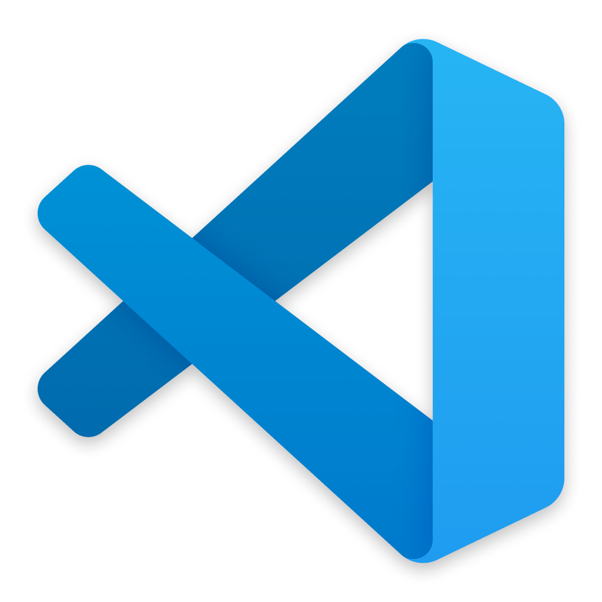

# VSCode Dotfiles

<p align="center">
  
</p>

<p align="center">
  <h4 align="center">Curated configuration ("dotfiles") for an opinionated Visual Studio Code setup</h4>
  <p align="center"><strong>Tested on:</strong> Linux x64, arm64 and x86</p>
</p>

VS Code OSS / VSCodium config, migrated from the standalone `void-land/vscode-dots` repo.

## Dotfiles included

| Path | Symlink target on disk |
|------|------------------------|
| `editors/vscode/configs/settings.json` | `~/.config/VSCodium/User/settings.json` and `~/.config/Code - OSS/User/settings.json` |
| `editors/vscode/configs/keybindings.json` | `~/.config/VSCodium/User/keybindings.json` and `~/.config/Code - OSS/User/keybindings.json` |
| `editors/vscode/configs/snippets/` | `~/.config/VSCodium/User/snippets/` and `~/.config/Code - OSS/User/snippets/` |

## Quick start

1. **Link the configurations** from the repo root (VS Code is linked along with everything else):

```bash
./stow.sh -s
```

1. **Install extensions** from the offline `.vsix` cache:

```bash
editors/vscode/extension-manager -v
```

1. **Restart VS Code**.

---

## Managing Extensions (`extension-manager`)

`editors/vscode/extension-manager` fetches, downloads and installs the extensions listed in `editors/vscode/oss-extensions.txt` from Open VSX. It keeps an offline `.vsix` cache in `editors/vscode/downloads/` (gitignored). Everything it does is driven by that list: removing an entry means it's no longer downloaded or installed, and its cached files are pruned on the next fetch or download.

| Flag | Action |
| --- | --- |
| `-f` | Fetch extension info from Open VSX into `extension_info/` |
| `-p` | Download missing `.vsix` files, 20 in parallel (falls back to sequential on curl < 7.83) |
| `-d` | Download missing `.vsix` files one at a time |
| `-v` | Install from the cache (offline, no `curl`/`jq` needed) and write `install.log` |
| `-l` | List extensions with version and cached ✓/✗ |
| `-c` | Complete setup: `-f` + `-p` + `-v` + `-l`, plus `extension_summary.txt` |
| `-y` | Assume yes for every prompt |

Flags run in the order given, so `-f -p -v` refreshes info, downloads what's new and installs. Files already downloaded are skipped, and older versions are pruned once the new one is in place. The script exits non-zero if anything failed.

### Prerequisites

Fetching and downloading need `curl` and `jq`. Listing needs `jq`. Installing needs only the editor CLI: the first one found of `codium`, `code-oss`, `code` or `code-insiders`. Override it with `VSCODE_CMD`:

```bash
VSCODE_CMD=code-oss editors/vscode/extension-manager -v
```

### Examples

```bash
editors/vscode/extension-manager -v          # offline install from the cache
editors/vscode/extension-manager -f -p       # refresh info, download what's missing
editors/vscode/extension-manager -c -y       # everything, no prompts
```

### Downloading Using a Proxy

If you are behind a restricted network, you can route the script's `curl` requests through a proxy using environment variables.

**Using an HTTP/HTTPS Proxy:**

```bash
http_proxy=http://127.0.0.1:8080 https_proxy=http://127.0.0.1:8080 editors/vscode/extension-manager -p
```

**Using a SOCKS5 Proxy:**
*(The `socks5h://` scheme forces DNS resolution through the proxy, which is often necessary)*

```bash
ALL_PROXY=socks5h://127.0.0.1:1080 editors/vscode/extension-manager -p
```
